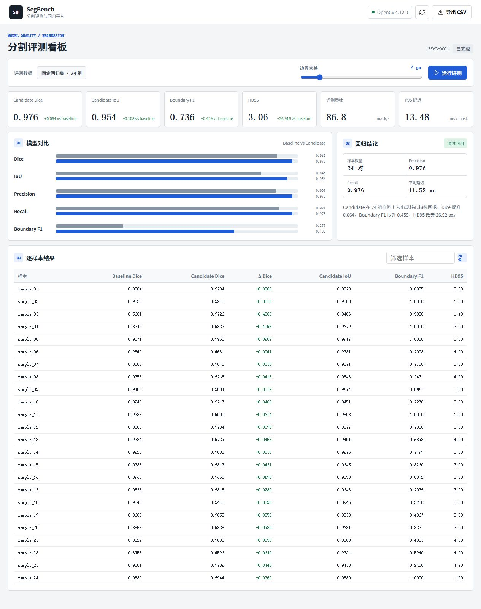

# SegBench · 分割评测与回归平台



现有个人算法工程的公共版本，基于 OpenCV 和 NumPy，统一评测 Dice、IoU、Precision、Recall、Boundary F1、HD95、延迟和吞吐。由 AI 工具辅助整理。

## 功能

- 固定随机种子生成 24 组 512×512 合成掩膜，对比 Baseline / Candidate。
- 汇总与逐样本回归，边界容差调整，样本搜索，CSV 导出。
- POST /api/evaluate 接收预测 / GT 掩膜的 Data URL，供私有实验流程在本机调用。
- 静态资源和评测均在本机运行，没有第三方脚本、遥测或图像上传。

## 运行

Python 3.10+ 推荐。

```bash
python -m venv .venv
# Linux/macOS: source .venv/bin/activate
# Windows: .venv\Scripts\activate
python -m pip install -r requirements.txt
python scripts/generate_sample_suite.py
python server.py --port 4174
```

打开 http://127.0.0.1:4174 。默认仅绑定回环地址。

```bash
python -m unittest discover -s tests -v
python scripts/benchmark.py
```

## 指标边界

benchmark_results/local_cpu.json 记录 2026-09-23 的历史 CPU 测量：24 组合成回归集、预热 5 次、完整测量 20 次；Candidate Dice 0.9764，平均 611.75 ms/轮。合成扰动产生的 Baseline / Candidate 不是训练模型，数字不代表患者、公开医学数据集或医院项目的模型精度。

POST /api/evaluate 示例：

```json
{"tolerance":2,"pairs":[{"name":"sample_001","prediction":"data:image/png;base64,...","target":"data:image/png;base64,..."}]}
```

两张空掩膜按 Dice/IoU=1 处理；单边空掩膜的 HD95 使用图像最大尺寸作为 Demo 惩罚值。评测协议应在科研比较前统一，不能与其他库默认值直接混用。当前 HD95 单位为像素，不包含医学体素间距。

[开源与私有内容边界](docs/OPEN_SOURCE_BOUNDARY.md)。MIT License；依赖见 THIRD_PARTY_NOTICES.md。
